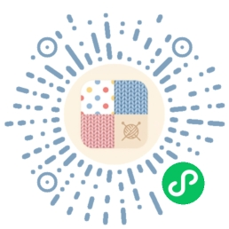
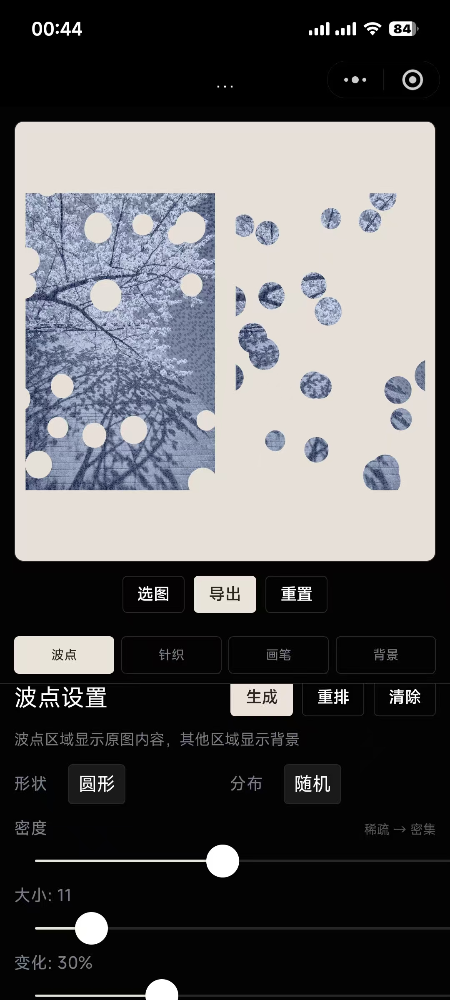
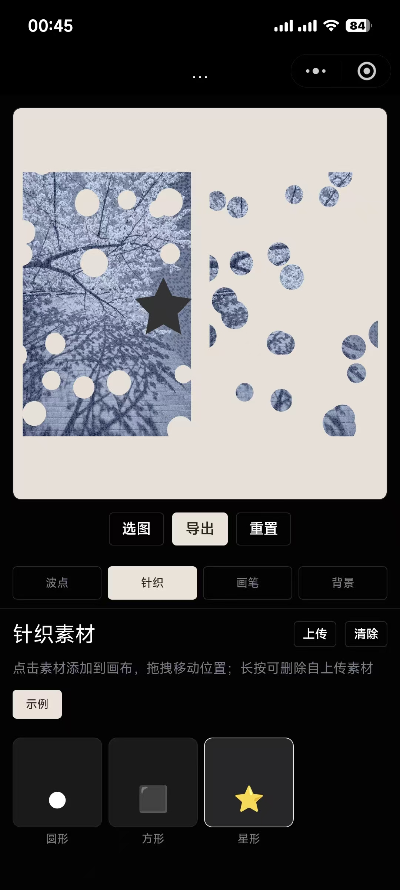
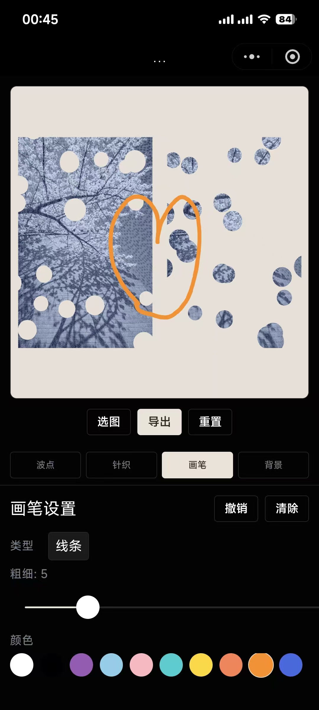

# 波点针织编辑器

> **⚠️ 当前版本处于早期阶段，可能存在功能简陋、交互不完善、已知或未知 Bug 等问题。**
> 如果你在使用过程中遇到任何问题或有改进建议，欢迎 [提交 Issue](https://github.com/byJming/dot-knit-editor/issues) 反馈，感谢支持！

微信小程序——波点拼接与针织素材创意编辑工具。

## 微信扫码体验

<p align="center">
  
</p>

<p align="center">使用微信扫一扫，即可体验小程序</p>

## 功能特性

- **拼接布局**：主图侧波点遮住原图，拓展侧波点显示被遮内容，形成正负互补的拼接效果
- **波点编辑**：6 种形状（圆形/方形/星形/水滴/雪花/字符），随机/网格分布，密度/大小/变化调节
- **针织素材**：内置示例素材 + 支持自上传素材（本地持久化），可拖拽移动、缩放、旋转
- **画笔工具**：4 种笔触（线条/表情/树叶/粉线），10 色调色板，支持撤销
- **背景设置**：纯色/斜条纹/照片三种背景
- **图片导出**：高清晰度保存至系统相册

## 界面预览

<p align="center">
  
  &nbsp;&nbsp;
  
  &nbsp;&nbsp;
  
</p>

## 项目结构

```
miniprogram/
├── app.js                       # 全局配置
├── app.json                     # 应用配置
├── app.wxss                     # 全局样式（设计系统）
├── assets/stamps/               # 素材图片目录
├── components/color-picker/     # HSV 颜色选择器组件
├── pages/editor/                # 主编辑页面
│   ├── editor.js                # 页面逻辑
│   ├── editor.json              # 页面配置
│   ├── editor.wxml              # 页面模板
│   └── editor.wxss              # 页面样式
├── utils/
│   ├── canvas.js                # Canvas 绘制引擎（波点/素材/画笔）
│   └── materials.js             # 素材库配置 + 用户素材管理
├── project.config.json          # 微信开发者工具配置
└── sitemap.json                 # 站点地图
```

## 快速开始

1. 克隆本仓库到本地
2. 使用微信开发者工具打开 `miniprogram` 目录
3. 在 `project.config.json` 中将 `appid` 替换为你自己的小程序 AppID（占位符为 `wxXXXXXXXXXXXXXXXX`）
4. 编译运行

## 使用说明

### 拼接布局
在波点面板顶部开启「拼接布局」开关，选择方向（主图在左/右/上/下），生成波点后即可预览拼接效果。

### 波点编辑
选择形状和分布模式，调节密度（1-10）、大小（5-50）、变化（0-100%），点击「生成」按钮。生成后可「重排」随机打乱波点位置，「清除」移除所有波点。

### 针织素材
- 切换素材分类标签浏览素材
- 点击素材添加到画布，在画布上拖拽调整位置
- 选中已放置素材后可通过滑块调整大小和旋转角度
- 点击「上传」从相册选择图片作为新素材，长按自上传素材可删除
- 点击「清除」移除所有已放置素材

### 画笔工具
选择笔触类型和颜色，在画布上自由绘制。支持「撤销」上一步和「清除」全部笔触。

### 背景设置
选择纯色（点击色块自定义颜色）、条纹（双色 + 宽度可调）或照片背景。

## 技术实现

- Canvas 2D API 进行所有绘制操作
- 波点使用复合裁剪路径实现遮罩/覆盖效果
- 拼接布局通过正反裁剪实现互补构图
- 矢量形状路径（星形/水滴/雪花）使用贝塞尔曲线绘制
- 用户素材通过 `wx.env.USER_DATA_PATH` + `wx.setStorageSync` 持久化
- 导出时使用 DPR 缩放保证清晰度

## 许可证

本项目采用 [PolyForm Noncommercial License 1.0.0](miniprogram/LICENSE)，仅供学习交流和非商业使用。

Copyright (c) 2026 ming <woqiang0610@163.com>
